# Diagrama de Flujo: PMS_TARMTTOIND

## Módulo: SDTARIND.BAS (~Línea 500)

### Propósito
Gestiona el proceso de tarificación para el **mantenimiento de pólizas individuales**. Coordina suplementos de:
- Cambio de forma de pago
- Cambio de tarifa
- Reactivaciones
- Inclusiones/exclusiones de asegurados
- Cambio de provincia de tarificación
- Cambio de tipo de descuento

---

## Diagrama Mermaid

```mermaid
flowchart TD
    subgraph INIT["🔧 INICIALIZACIÓN"]
        A[/"PMS_TARMTTOIND()"/] --> B["Obtener Usuario<br/>Verificar SwProrrateos<br/>Detectar cambio Tomador"]
        B --> C["Obtener Forma de Pago<br/>desde CB_Fopa"]
        C --> D["G_SW_TARMTTO = 0"]
    end

    subgraph DETECT["🔍 DETECCIÓN DE CAMBIOS"]
        D --> E{{"¿G_Sw_Abrir=-1 AND<br/>G_Sw_Cob_Esp=-1?"}}
        E -->|Sí| F["G_SW_TARMTTO = 1"]
        E -->|No| G{{"¿G_Sw_Abrir=-1 AND<br/>G_SWSUPL=-1?"}}
        G -->|Sí| F
        G -->|No| H{{"¿Cambio en<br/>IDEX, CDTA, FVTAR,<br/>FOPA, TIPA, FECM,<br/>FECB, Provincia,<br/>Descuento, ESPA?"}}
        H -->|Sí| F
        H -->|No| I{{"¿G_SW_RETARIFICAR?"}}
        I -->|Sí| F
        I -->|No| J["G_SW_TARMTTO = 0"]
    end

    subgraph LOAD["📥 CARGA DATOS PÓLIZA"]
        F --> K["SELECT DTPOLI<br/>FOR UPDATE<br/>(bloqueo de fila)"]
        J --> K
        K --> L["Cargar variables globales:<br/>G_POLICDDE, G_POLINPOL,<br/>G_POLIFECA, G_POLICDPT, etc."]
    end

    subgraph VALIDATE["✅ VALIDACIÓN"]
        L --> M{{"¿G_SW_TARMTTO = 1<br/>OR Cambio Tomador?"}}
        M -->|No| EXIT1[/"FIN - Sin cambios"/]
        M -->|Sí| N["Detectar tipos de cambio:<br/>bCambio_FPago, bCambio_Tarifa,<br/>bReactivacion, bCambio_TipoDescuento,<br/>bProvincia, bOtros_Suplementos"]
        N --> O{{"¿Múltiples cambios<br/>simultáneos?"}}
        O -->|Sí| P["MsgBox: Realice un<br/>sólo cambio a la vez"]
        P --> Q["G_TECLA_PRORRATEO = vbCancel"]
        Q --> EXIT2[/"FIN - Cancelado"/]
    end

    subgraph TARIFA["📊 CAMBIO DE TARIFA"]
        O -->|No| R{{"¿bCambio_Tarifa?"}}
        R -->|Sí| S{{"¿Tiene descuento<br/>Siniestralidad o Pricing?"}}
        S -->|Sí| T["MsgBox: ¿Mantener descuentos?"]
        T --> U{{"Respuesta"}}
        U -->|Cancelar| Q
        U -->|No| V["Limpiar G_GruposDescuento<br/>SalvarDescuentos"]
        U -->|Sí| W["Continuar con descuentos"]
        S -->|No| W
        V --> W
    end

    subgraph FECHA["📅 SOLICITAR FECHA EFECTO"]
        W --> X{{"¿bCambio_Tarifa OR<br/>bCambio_TipoDescuento<br/>OR bProvincia?"}}
        R -->|No| X
        X -->|Sí| Y["InputBox: Fecha de efecto"]
        Y --> Z{{"¿Fecha válida?"}}
        Z -->|No| AA["MsgBox: Fecha Incorrecta"]
        AA --> Q
        Z -->|Sí| AB["F_TARIFI = strFecha_Operacion"]
    end

    subgraph FPAGO["💳 CAMBIO FORMA PAGO"]
        X -->|No| AC{{"¿bCambio_FPago?"}}
        AC -->|Sí| AD{{"¿Formas pago similares?"}}
        AD -->|Sí| AE["MsgBox: Similares"]
        AE --> EXIT3[/"FIN"/]
        AD -->|No| AF["Calcular strFecha_Operacion"]
        AF --> AG["UPDATE DTPOLI SET POLIFEER"]
        AG --> AH["Verificar prorrateos STPROR"]
        AH --> AI["Pasa_Parametros Cte_FormaPago"]
    end

    subgraph CAMBIOTARIFA["🔄 PROCESAR CAMBIO TARIFA"]
        AB --> AJ{{"¿bCambio_Tarifa?"}}
        AJ -->|Sí| AK["UPDATE POLIFVTAR"]
        AK --> AL["Pasa_Parametros Cte_CambioTarifa"]
    end

    subgraph REACT["🔄 REACTIVACIÓN"]
        AJ -->|No| AM{{"¿bReactivacion?"}}
        AC -->|No| AM
        AM -->|Sí| AN["DELETE T_GEN_HISTTARI"]
        AN --> AO["UPDATE PETICION_AUT caducadas"]
        AO --> AP["ObtenerTarifaReactivacion"]
        AP --> AQ{{"¿Tarifa diferente?"}}
        AQ -->|Sí| AR["Actualizar tarifa"]
        AQ -->|No| AS["ObtenerTipoDescuentoReactivacion"]
        AR --> AS
        AS --> AT{{"¿Descuento diferente?"}}
        AT -->|Sí| AV["AsignarArrayGrupoDescuentos"]
        AT -->|No| AW["Continuar"]
        AV --> AW
    end

    subgraph SINIEST["📈 CÁLCULO SINIESTRALIDAD"]
        AW --> AX{{"¿Descuento G05 activo?"}}
        AX -->|Sí| AY["CalculaPorcentajeGrupo"]
        AY --> AZ{{"¿Tiene techo/suelo?"}}
        AZ -->|Sí| BA["SELECT asegurados activos"]
        BA --> BB["Loop: Pasa_Parametros<br/>Cte_TarificacionOnline"]
        BB --> BC{{"¿Ajuste necesario?"}}
        BC -->|Sí| BD["Calcular % ajuste"]
        BC -->|No| BG["Mantener % fijo"]
        BD --> BH["blnAplicaTecho = True"]
        AZ -->|No| BG
        BG --> BI["Continuar"]
        BH --> BI
        AX -->|No| BI
    end

    subgraph UPDATEDB["💾 ACTUALIZAR BD"]
        BI --> BN["UPDATE DTPOLI<br/>POLIINDTESU, POLIDESC_G06,<br/>POLIDESC_G07, POLIINDOPT"]
        BN --> BQ["SalvarDescuentos"]
        BQ --> BR["Pasa_Parametros Cte_Reactivacion"]
    end

    subgraph OTROS["📋 OTROS SUPLEMENTOS"]
        AM -->|No| BS{{"¿bOtros_Suplementos?"}}
        BS -->|Sí| BT["Determinar tipo movimiento"]
        BT --> BU["Query_PricingVCWS"]
        BU --> BV["Pasa_Parametros según tipo"]
        BS -->|No| BW["Sin procesamiento"]
    end

    subgraph CONFIRM["✅ CONFIRMACIÓN"]
        AI --> BX["Mostrar_Pantalla_Confirmacion"]
        AL --> BX
        BR --> BX
        BV --> BX
        BW --> BX
        BX --> BY["PMS_BORRA_DETALLE_PRORRATEO"]
        BY --> EXIT4[/"FIN"/]
    end
```



---

## Descripción Detallada de Bloques

### 1. 🔧 INICIALIZACIÓN (Líneas ~500-520)
```
- Obtiene usuario del entorno: Environ$("USR")
- Verifica SwProrrateos para determinar si emitir prorrateos
- Detecta cambio de tomador comparando DCAS015.TX_Cliecdcl con G_POLI_TOMADOR
- Obtiene forma de pago del combo CB_Fopa
- Inicializa G_SW_TARMTTO = 0
```

### 2. 🔍 DETECCIÓN DE CAMBIOS (Líneas ~520-570)
Compara valores actuales vs anteriores (G_POLI2*):
| Campo | Variable Anterior | Variable Actual |
|-------|-------------------|-----------------|
| IDEX | G_POLI2IDEX | G_CHECK |
| CDTA (Tarifa) | G_POLI2CDTA | DCAS015.TX_CDTA |
| FVTAR (Versión) | G_POLI2FVTAR | G_POLIFVTAR |
| FOPA (Forma Pago) | G_POLI2FOPA | Forma_Pago |
| TIPA (Tipo) | G_POLI2TIPA | DCAS015.CB_Tipa |
| FECM | G_POLI2FECM | G_POLIFECM |
| FECB (Baja) | G_POLI2FECB | DCAS015.TX_Fech(2) |
| Provincia | G_POLI2PROVINCIA_TARIFICACION | DCAS017.Cmb_ProvinciaTar |
| Descuentos | G_Grupos2Descuento | G_GruposDescuento |
| ESPA (Estado) | G_POLI2ESPA | DCAS015.CB_Espa |

### 3. 📥 CARGA DATOS PÓLIZA (Líneas ~575-620)
```java
@Lock(LockModeType.PESSIMISTIC_WRITE)
@Query("""
    SELECT 
        p.delegationCode,
        p.policyNumber,
        p.effectiveDate,
        p.productCode,
        p.paymentMethod,
        p.specialCoverageFlag,
        p.collector,
        p.netPremium,
        p.netPremiumPesos,
        p.currentReceipt,
        p.currentReceiptPesos,
        p.totalImport,
        p.totalImportPesos,
        p.totalRate,
        p.unitPrice,
        p.unitPriceEuros,
        p.numberOfInsured,
        p.nextIssuanceDate,
        CAST(NULL AS String) AS discountType,
        p.renewalType2,
        p.expirationDate
    FROM PolicyEntity p
    WHERE p.delegationCode = :delegationCode 
      AND p.policyNumber = :policyNumber
    """)
Optional<PolicyDataProjection> findPolicyDataForUpdate(
    @Param("delegationCode") Integer delegationCode,
    @Param("policyNumber") Integer policyNumber);
```

### 4. ✅ VALIDACIÓN (Líneas ~625-660)
- Detecta tipos de suplemento mediante flags booleanos
- **Restricción importante**: Solo permite UN tipo de cambio a la vez
- Combinaciones prohibidas que lanzan error:
  - Cambio FPago + Cambio Tarifa
  - Cambio Tarifa + Reactivación
  - Cambio Descuento + Cambio Provincia
  - etc.

### 5. 📊 CAMBIO DE TARIFA (Líneas ~665-720)
- Si tiene descuento de siniestralidad (G05) o pricing (G06):
  - Pregunta al usuario si mantener o quitar
  - Si quita: limpia grupos 5 y 6
  - Llama a `SalvarDescuentos`

### 6. 📅 SOLICITAR FECHA EFECTO (Líneas ~725-760)
```vb
strFecha_Operacion = InputBox("Introduzca una fecha de efecto...", "FECHA DE EFECTO", G_POLIFECA)
```
- Valida que fecha esté entre FECA (alta) y HOY
- No permite fechas futuras excepto si coincide con fecha de alta

### 7. 💳 CAMBIO FORMA PAGO (Líneas ~765-850)
- Calcula nueva fecha de última emisión según meses de la forma de pago
- Funciones utilizadas:
  - `Proxima_Emision()` - Calcula próxima fecha emisión
  - `Meses_FPago()` - Obtiene meses por forma de pago
  - `UltEmision_Poliza()` - Última emisión de la póliza
- Actualiza POLIFEER en DTPOLI
- Verifica prorrateos pendientes en STPROR

### 8. 🔄 REACTIVACIÓN (Líneas ~855-1050)
Proceso complejo que incluye:
1. Limpieza de histórico si fue anulación sin efecto
2. Caducación de peticiones automáticas antiguas (>12 meses)
3. Obtención de tarifa de reactivación
4. Obtención de descuentos de reactivación
5. Cálculo de descuento de siniestralidad con techos/suelos
6. Actualización de estados en T_SIN_GRUPOS y T_DES_OPTIMIZACION

### 9. 📈 CÁLCULO SINIESTRALIDAD (Líneas ~900-1000)
```
Loop de cálculo de techos/suelos:
  intTrataTechos = 0 o 1 o 2
  - 1: Primera iteración - detectar si aplica
  - 2: Segunda iteración - calcular ajuste
  - 0: Finalizado
  
  dblPrimaFinal = dblPrimaInicial * dblTechoSuelo / 100
  G_GruposDescuento(5).Valor = Round(-(dblPrimaCalc - dblPrimaFinal) * 100 / dblPrimaCalc, 2)
```

### 10. 📋 OTROS SUPLEMENTOS (Líneas ~1050-1150)
Tipos de movimiento según situación:
| Condición | Constante Movimiento |
|-----------|---------------------|
| Inclusión asegurados | Cte_InclusionOnLine |
| Cambio provincia | Cte_CambioProvincia |
| Baja póliza | Cte_BajaOnline |
| Otros | Cte_OtrosSuplementosOnline |

Llama a `Query_PricingVCWS` para venta cruzada si aplica.

### 11. ✅ CONFIRMACIÓN (Líneas ~1155-1165)
```vb
Mostrar_Pantalla_Confirmacion sPoliza, ...primas..., Forma_Pago, Fecha_Efecto, bPostDatado, Fecha_Tarifica
PMS_BORRA_DETALLE_PRORRATEO(Poliza, "0", "")
```

---

## Tablas Afectadas

| Tabla | Operación | Propósito |
|-------|-----------|-----------|
| DTPOLI | SELECT/UPDATE | Datos principales póliza |
| STPROR | SELECT | Verificar prorrateos pendientes |
| T_GEN_HISTTARI | DELETE | Limpiar histórico tarifas |
| PETICION_AUT | SELECT/UPDATE | Peticiones automáticas |
| T_DES_GRUPOS | SELECT | Grupos de descuento |
| DTPOCL | SELECT | Clientes de póliza |
| TSPOPC | SELECT | Primas por cliente |
| T_SIN_GRUPOS | UPDATE | Estado siniestralidad |
| T_DES_OPTIMIZACION | UPDATE | Estado optimización |
| T_DES_POLIZAS_DCTO | UPDATE | Descuentos por póliza |

---

## Funciones Llamadas

| Función | Módulo | Propósito |
|---------|--------|-----------|
| `Pasa_Parametros` | SDTARIFI | Motor de tarificación PL/SQL |
| `Mostrar_Pantalla_Confirmacion` | SDTARIND | Muestra formulario DTAS005 |
| `ObtenerTarifaReactivacion` | mMejorasT | Tarifa para reactivación |
| `ObtenerTipoDescuentoReactivacion` | MdlTiposDescuento | Descuentos para reactivación |
| `CalculaPorcentajeGrupo` | MdlTiposDescuento | Calcula % de descuento |
| `SalvarDescuentos` | MdlTiposDescuento | Persiste descuentos |
| `Query_PricingVCWS` | MdlTiposDescuento | Consulta WS venta cruzada |
| `Proxima_Emision` | SDTARIFI | Calcula próxima emisión |
| `UltEmision_Poliza` | SDTARIFI | Última emisión póliza |
| `CambioDescuento` | MdlTiposDescuento | Compara arrays descuento |

---

## Notas de Migración

1. **Complejidad ciclomática muy alta**: Esta función debería dividirse en múltiples servicios en Java
2. **Patrón sugerido**: Strategy pattern para cada tipo de suplemento
3. **Transaccionalidad**: El `FOR UPDATE` requiere `@Transactional` con `LockModeType.PESSIMISTIC_WRITE`
4. **Variables globales**: Deben convertirse en parámetros de servicio o DTOs

## Pop-ups avisos

##  Llamadas a `Mostrar_Pantalla_Confirmacion`

Hay **2 llamadas** a `Mostrar_Pantalla_Confirmacion`:

###  Llamada 1 — Línea **478**
- **Ubicación:** Dentro de una función (probablemente *colectivos*)
- **Comentario:**  
  > Muestra la pantalla de confirmación con los importes de la operación

###  Llamada 2 — Línea **1386**
- **Ubicación:** Dentro de `PMS_TARMTTOIND()`
- **Comentario:**  
  > Muestra la pantalla con la información de los prorrateos y primas anuales resultantes

---

##  Pantallas Emergentes — Cadena de Llamadas


---

##  Fase 1: Dentro de `PMS_TARMTTOIND()` (línea 500+)

###  Línea 711 — Error crítico
- **Condición:** Se detectan múltiples cambios simultáneos
- **Mensaje:**  
  > "Realice un sólo cambio a la vez"
- **Tipo:** `vbCritical`

---

###  Línea 719 — Pregunta Sí / No / Cancelar
- **Condición:**  
  `bCambio_Tarifa = True` **y** existen descuentos de siniestralidad/pricing
- **Mensaje:**  
  > "Realizar un cambio de tarifa puede implicar perder los descuentos actuales, incluyendo siniestralidad y pricing..."
- **Tipo:** `vbYesNoCancel`

---

###  Línea 724 — Pregunta Sí / No
- **Condición:**  
  `bCambio_Tarifa = True` **y** no existen descuentos de siniestralidad/pricing
- **Mensaje:**  
  > "Realizar un cambio de tarifa puede implicar perder los descuentos actuales..."
- **Tipo:** `vbYesNo`

---

###  Línea 772 — Error crítico
- **Condición:** Validación de fecha falló
- **Mensaje:**  
  > "La fecha debe estar comprendida entre el [fecha] y el [fecha]"
- **Tipo:** `vbCritical`

---

###  Línea 834 — Mensaje informativo
- **Condición:**  
  `bCambio_FPago = True` **y** existen prorrateos pendientes
- **Mensaje:**  
  > "Compruebe los prorrateos pendientes de la póliza"
- **Tipo:** Informativo (por defecto)

---

###  Línea 840 — Mensaje informativo
- **Condición:**  
  `bCambio_FPago = True` **y** las formas de pago son similares
- **Mensaje:**  
  > "Las formas de pago son similares"
- **Tipo:** Informativo (por defecto)

---

###  Línea 849 — Mensaje informativo
- **Condición:**  
  `G_Fecha_Asegurado <> ""` **y** se detecta operación de rehabilitación
- **Mensaje:**  
  > "Revise los prorrateos y recibos previos"
- **Tipo:** Informativo (por defecto)

---

###  Línea 1300 — Mensaje informativo
- **Condición:**  
  La fecha de efecto del suplemento no tiene primas definidas
- **Mensaje:**  
  > "Se ha encontrado que para la fecha de efecto del suplemento no hay definidas unas primas..."
- **Tipo:** `vbInformation`

---

###  Línea 1338 — Error crítico (Servicio Web)
- **Condición:**  
  `MdlTiposDescuento.QRYPRICINGWS_STR <> ""`
- **Mensaje:**  
  > Mensaje de error devuelto por el Servicio Web
- **Tipo:** `vbCritical`

---

##  Fase 2: Dentro de `Mostrar_Pantalla_Confirmacion()` (línea 46+)  
*(Llamada desde `PMS_TARMTTOIND()`)*

###  Línea 93 — Mensaje informativo
- **Condición:**  
  `Trim(CDbl(DTAS005.TX_TORE.Text)) > 5000`  
  **o**  
  `Trim(CDbl(DTAS005.TX_PROR.Text)) > 5000`
- **Mensaje:**  
  > "EL RECIBO QUE SE GENERARÁ SUPERA LOS 5.000 €"
- **Tipo:** `vbInformation`

---

###  Línea 100 — Pregunta Sí / No  *(la más probable)*
- **Condición:**  
  `CCurNoNulls(DTAS005.TX_TORE.Text) = 0`
- **Mensaje:**  
  > "El importe de la prima de la póliza es 0. ¿Desea de todos modos continuar con la grabación de la póliza?"
- **Tipo:** `vbYesNo` *(Aceptar / Cancelar)*
- **Acción:**  
  Asigna valor a `G_TECLA_PRORRATEO`


  ---

  ## Queries que hace TARMTTOIND


  - **Query de linia 631, recupera datos antiguos de DTPOLI**
 
```sql
SELECT POLICDDE, -- NUMBER(3,0) Código de delegación gestora
       POLINPOL, -- NUMBER(9,0) N. poliza
       POLIFECA, -- VARCHAR2(8) Fecha alta
       POLICDPT, -- NUMBER(4,0) Codigo de producto
       POLIFOPA, -- VARCHAR(2) Forma de pago
       POLIIDCO, -- VARCHAR2(1) Indicador coberturas especiales (S/N)
       POLICOBR, -- VARCHAR2(9) NIF Cobrador
       POLIPRNT, -- NUMBER(14,4) Prima Neta
       POLIPRNE, -- NUMBER(14,4) Prima Neta Extranjero
       POLIRECA, -- NUMBER(14,4) Recargo
       POLIRECE, -- NUMBER(14,4) Recargo Extranjero
       POLIIMPT, -- NUMBER(14,4) Impuestos
       POLIIMPE, -- NUMBER(14,4) Impuestos Extranjero
       POLITORE, -- NUMBER(14,4) Total Recibo
       POLIIPUN, -- NUMBER(14,4) Impuesto Anualizado
       POLIIPUE, -- NUMBER(14,4) Impuesto Anualizado Extranjero
       POLINUPE, -- NUMBER(5,0)  Numero Asegurados
       POLIFEER, -- VARCHAR2(6)  Fecha ultima cartera
       NULL POLITIPO_DCTO, -- VARCHAR2(3) Tipo descuento
       POLITREN, -- VARCHAR2(2) Tipo de Renovación
       POLIFEVE  -- VARCHAR2(8) Fecha de Vencimiento
FROM DTPOLI 
WHERE POLICDDE = :codigoDelegacion
  AND POLINPOL = :numeroPoliza
FOR UPDATE;
```

## Líneas 820 y 890

Actualiza la fecha de última cartera emitida (**POLIFEER**)  
para una póliza específica (**POLINPOL**).

```sql
UPDATE DTPOLI 
SET POLIFEER = :fechaUltimaCartera
WHERE POLINPOL = :numeroPoliza
```

---

## Línea 825

Busca prorrateos pendientes en la tabla **STPROR**.

### Condiciones
- **PRORNPOL** = número de póliza
- **PRORCDCE** = 0 (certificado 0 → póliza)
- **PRORSITU** = '01' (estado de prorrateo activo)
- **PRORTORE <> PRORIPUN + PRORIPUE**  
  (el total del recibo no coincide con la suma de impuestos)

```sql
SELECT PRORNPOL,    -- NUMBER(9,0) Número de póliza
       PRORCDCE     -- NUMBER(5,0) Código de certificado
FROM STPROR 
WHERE PRORNPOL = :numeroPoliza
  AND PRORCDCE = 0
  AND PRORSITU = '01' 
  AND PRORTORE = :totalRecibo <> PRORIPUN = :impuestoAnualizado + PRORIPUE = :impuestoAnualizadoExtranjero
```

---

## Líneas 902 y 905

Actualiza la fecha de versión de tarifa (**POLIFVTAR**).

- Si cambió el código de tarifa: se establece al **01/01 del año actual**
- Si NO cambió el código de tarifa: se usa la fecha seleccionada (**G_POLIFVTAR**)

### Línea 902 (si cambió el código de tarifa)

```sql
UPDATE DTPOLI 
SET POLIFVTAR = :fechaVersionTarifa
WHERE POLINPOL = :numeroPoliza
```

### Línea 905 (si NO cambió el código de tarifa)

```sql
UPDATE DTPOLI 
SET POLIFVTAR = :fechaVersionTarifa
WHERE POLINPOL = :numeroPoliza
```

---

## Reactivación de póliza

### Línea 950 (DELETE)

Se ejecuta durante la reactivación de la póliza.  
Elimina el histórico de tarificación anterior.

### Condiciones
- Mismo número de póliza
- Certificado 0 (póliza)
- Fecha menor que la fecha de vencimiento actual

```sql
DELETE FROM T_GEN_HISTTARI 
WHERE HISTNPOL = :numeroPoliza
  AND HISTCDCE = 0
  AND HISTFECH < :fechaFinalizacionUsoDePrecioTarifa
```

---

### Línea 956 (UPDATE)

Marca peticiones automáticas antiguas como caducadas (**ESTADO = '04'**).

### Condiciones
- Estado activo (**'01'**)
- Fecha de petición con más de 12 meses de antigüedad

```sql
UPDATE PETICION_AUT 
SET ESTADO = '04' 
WHERE ESTADO = '01' 
  AND FECHA_PETICION < :fechaPeticion
```
(La fecha de petición es la actual -12 meses)
---

### Línea 978 (UPDATE DTPOLI)

Contexto: reactivación de póliza cuando **cambia la tarifa**.

Actualiza la fecha de versión de tarifa (**POLIFVTAR**) asignándola  
al primer día del año de la fecha de tarificación:

POLIFVTAR = LEFT(G_POLIFETA, 4) || '0101'  
Ejemplo: G_POLIFETA = '20260315' → POLIFVTAR = '20260101'

```sql
UPDATE DTPOLI 
SET POLIFVTAR = :fechaVersionTarifa
WHERE POLINPOL = :numeroPoliza
```

---

### Línea 984 (UPDATE PETICION_AUT)

Contexto: reactivación cuando **cambió la tarifa**.

Marca peticiones automáticas como completadas (**ESTADO = '02'**).

### Condiciones
- Póliza específica
- Certificado 0
- Tipo de petición = '01' (cambio de tarifa)
- Fecha de petición menor o igual a la fecha de efectividad
- Antigüedad menor a 12 meses

```sql
UPDATE PETICION_AUT 
SET ESTADO = '02'
WHERE POLIZA = :numeroPoliza
  AND CERTIFICADO = 0 
  AND TIPO_PETICION = '01'
  AND FECHA_PETICION <= :fechaPeticion
  AND TO_CHAR(ADD_MONTHS(TO_DATE(FECHA_PETICION, 'YYYYMMDD'), 12), 'YYYYMMDD') > ?
```

---

### Línea 1000 (SELECT)

Contexto: detección de cambios en descuentos durante reactivación.

Obtiene todos los grupos de descuentos disponibles  
(códigos menores que 90), ordenados por código.

Propósito: iterar y comparar descuentos antiguos vs nuevos.

```sql
SELECT *
FROM T_DES_GRUPOS 
WHERE DGRUCODG < 90 
ORDER BY 1
```

---

### Línea 1015 (UPDATE PETICION_AUT)

Contexto: reactivación cuando **cambió el descuento**.

Marca peticiones automáticas de cambio de descuento  
(**TIPO_PETICION = '02'**) como completadas (**ESTADO = '02'**).

Mismo rango de 12 meses que la query anterior.

```sql
UPDATE PETICION_AUT 
SET ESTADO = '02'
WHERE POLIZA = ?
  AND CERTIFICADO = 0 
  AND TIPO_PETICION = '02'
  AND FECHA_PETICION <= ?
  AND TO_CHAR(ADD_MONTHS(TO_DATE(FECHA_PETICION, 'YYYYMMDD'), 12), 'YYYYMMDD') > ?
```


