# Diagrama de Flujo: PMS_TARMTTOIND

## Módulo: SDTARIND.BAS (~Línea 500)

### Propósito
Gestiona el proceso de tarificación para el **mantenimiento de pólizas individuales**. Coordina suplementos de:
- Cambio de forma de pago
- Cambio de tarifa
- Reactivaciones
- Inclusiones/exclusiones de asegurados
- Cambio de provincia de tarificación
- Cambio de tipo de descuento

---

## Diagrama Mermaid

```mermaid
flowchart TD
    subgraph INIT["🔧 INICIALIZACIÓN"]
        A[/"PMS_TARMTTOIND()"/] --> B["Obtener Usuario<br/>Verificar SwProrrateos<br/>Detectar cambio Tomador"]
        B --> C["Obtener Forma de Pago<br/>desde CB_Fopa"]
        C --> D["G_SW_TARMTTO = 0"]
    end

    subgraph DETECT["🔍 DETECCIÓN DE CAMBIOS"]
        D --> E{{"¿G_Sw_Abrir=-1 AND<br/>G_Sw_Cob_Esp=-1?"}}
        E -->|Sí| F["G_SW_TARMTTO = 1"]
        E -->|No| G{{"¿G_Sw_Abrir=-1 AND<br/>G_SWSUPL=-1?"}}
        G -->|Sí| F
        G -->|No| H{{"¿Cambio en<br/>IDEX, CDTA, FVTAR,<br/>FOPA, TIPA, FECM,<br/>FECB, Provincia,<br/>Descuento, ESPA?"}}
        H -->|Sí| F
        H -->|No| I{{"¿G_SW_RETARIFICAR?"}}
        I -->|Sí| F
        I -->|No| J["G_SW_TARMTTO = 0"]
    end

    subgraph LOAD["📥 CARGA DATOS PÓLIZA"]
        F --> K["SELECT DTPOLI<br/>FOR UPDATE<br/>(bloqueo de fila)"]
        J --> K
        K --> L["Cargar variables globales:<br/>G_POLICDDE, G_POLINPOL,<br/>G_POLIFECA, G_POLICDPT, etc."]
    end

    subgraph VALIDATE["✅ VALIDACIÓN"]
        L --> M{{"¿G_SW_TARMTTO = 1<br/>OR Cambio Tomador?"}}
        M -->|No| EXIT1[/"FIN - Sin cambios"/]
        M -->|Sí| N["Detectar tipos de cambio:<br/>bCambio_FPago, bCambio_Tarifa,<br/>bReactivacion, bCambio_TipoDescuento,<br/>bProvincia, bOtros_Suplementos"]
        N --> O{{"¿Múltiples cambios<br/>simultáneos?"}}
        O -->|Sí| P["MsgBox: Realice un<br/>sólo cambio a la vez"]
        P --> Q["G_TECLA_PRORRATEO = vbCancel"]
        Q --> EXIT2[/"FIN - Cancelado"/]
    end

    subgraph TARIFA["📊 CAMBIO DE TARIFA"]
        O -->|No| R{{"¿bCambio_Tarifa?"}}
        R -->|Sí| S{{"¿Tiene descuento<br/>Siniestralidad o Pricing?"}}
        S -->|Sí| T["MsgBox: ¿Mantener descuentos?"]
        T --> U{{"Respuesta"}}
        U -->|Cancelar| Q
        U -->|No| V["Limpiar G_GruposDescuento<br/>SalvarDescuentos"]
        U -->|Sí| W["Continuar con descuentos"]
        S -->|No| W
        V --> W
    end

    subgraph FECHA["📅 SOLICITAR FECHA EFECTO"]
        W --> X{{"¿bCambio_Tarifa OR<br/>bCambio_TipoDescuento<br/>OR bProvincia?"}}
        R -->|No| X
        X -->|Sí| Y["InputBox: Fecha de efecto"]
        Y --> Z{{"¿Fecha válida?"}}
        Z -->|No| AA["MsgBox: Fecha Incorrecta"]
        AA --> Q
        Z -->|Sí| AB["F_TARIFI = strFecha_Operacion"]
    end

    subgraph FPAGO["💳 CAMBIO FORMA PAGO"]
        X -->|No| AC{{"¿bCambio_FPago?"}}
        AC -->|Sí| AD{{"¿Formas pago similares?"}}
        AD -->|Sí| AE["MsgBox: Similares"]
        AE --> EXIT3[/"FIN"/]
        AD -->|No| AF["Calcular strFecha_Operacion"]
        AF --> AG["UPDATE DTPOLI SET POLIFEER"]
        AG --> AH["Verificar prorrateos STPROR"]
        AH --> AI["Pasa_Parametros Cte_FormaPago"]
    end

    subgraph CAMBIOTARIFA["🔄 PROCESAR CAMBIO TARIFA"]
        AB --> AJ{{"¿bCambio_Tarifa?"}}
        AJ -->|Sí| AK["UPDATE POLIFVTAR"]
        AK --> AL["Pasa_Parametros Cte_CambioTarifa"]
    end

    subgraph REACT["🔄 REACTIVACIÓN"]
        AJ -->|No| AM{{"¿bReactivacion?"}}
        AC -->|No| AM
        AM -->|Sí| AN["DELETE T_GEN_HISTTARI"]
        AN --> AO["UPDATE PETICION_AUT caducadas"]
        AO --> AP["ObtenerTarifaReactivacion"]
        AP --> AQ{{"¿Tarifa diferente?"}}
        AQ -->|Sí| AR["Actualizar tarifa"]
        AQ -->|No| AS["ObtenerTipoDescuentoReactivacion"]
        AR --> AS
        AS --> AT{{"¿Descuento diferente?"}}
        AT -->|Sí| AV["AsignarArrayGrupoDescuentos"]
        AT -->|No| AW["Continuar"]
        AV --> AW
    end

    subgraph SINIEST["📈 CÁLCULO SINIESTRALIDAD"]
        AW --> AX{{"¿Descuento G05 activo?"}}
        AX -->|Sí| AY["CalculaPorcentajeGrupo"]
        AY --> AZ{{"¿Tiene techo/suelo?"}}
        AZ -->|Sí| BA["SELECT asegurados activos"]
        BA --> BB["Loop: Pasa_Parametros<br/>Cte_TarificacionOnline"]
        BB --> BC{{"¿Ajuste necesario?"}}
        BC -->|Sí| BD["Calcular % ajuste"]
        BC -->|No| BG["Mantener % fijo"]
        BD --> BH["blnAplicaTecho = True"]
        AZ -->|No| BG
        BG --> BI["Continuar"]
        BH --> BI
        AX -->|No| BI
    end

    subgraph UPDATEDB["💾 ACTUALIZAR BD"]
        BI --> BN["UPDATE DTPOLI<br/>POLIINDTESU, POLIDESC_G06,<br/>POLIDESC_G07, POLIINDOPT"]
        BN --> BQ["SalvarDescuentos"]
        BQ --> BR["Pasa_Parametros Cte_Reactivacion"]
    end

    subgraph OTROS["📋 OTROS SUPLEMENTOS"]
        AM -->|No| BS{{"¿bOtros_Suplementos?"}}
        BS -->|Sí| BT["Determinar tipo movimiento"]
        BT --> BU["Query_PricingVCWS"]
        BU --> BV["Pasa_Parametros según tipo"]
        BS -->|No| BW["Sin procesamiento"]
    end

    subgraph CONFIRM["✅ CONFIRMACIÓN"]
        AI --> BX["Mostrar_Pantalla_Confirmacion"]
        AL --> BX
        BR --> BX
        BV --> BX
        BW --> BX
        BX --> BY["PMS_BORRA_DETALLE_PRORRATEO"]
        BY --> EXIT4[/"FIN"/]
    end
```



---

## Descripción Detallada de Bloques

### 1. 🔧 INICIALIZACIÓN (Líneas ~500-520)
```
- Obtiene usuario del entorno: Environ$("USR")
- Verifica SwProrrateos para determinar si emitir prorrateos
- Detecta cambio de tomador comparando DCAS015.TX_Cliecdcl con G_POLI_TOMADOR
- Obtiene forma de pago del combo CB_Fopa
- Inicializa G_SW_TARMTTO = 0
```

### 2. 🔍 DETECCIÓN DE CAMBIOS (Líneas ~520-570)
Compara valores actuales vs anteriores (G_POLI2*):
| Campo | Variable Anterior | Variable Actual |
|-------|-------------------|-----------------|
| IDEX | G_POLI2IDEX | G_CHECK |
| CDTA (Tarifa) | G_POLI2CDTA | DCAS015.TX_CDTA |
| FVTAR (Versión) | G_POLI2FVTAR | G_POLIFVTAR |
| FOPA (Forma Pago) | G_POLI2FOPA | Forma_Pago |
| TIPA (Tipo) | G_POLI2TIPA | DCAS015.CB_Tipa |
| FECM | G_POLI2FECM | G_POLIFECM |
| FECB (Baja) | G_POLI2FECB | DCAS015.TX_Fech(2) |
| Provincia | G_POLI2PROVINCIA_TARIFICACION | DCAS017.Cmb_ProvinciaTar |
| Descuentos | G_Grupos2Descuento | G_GruposDescuento |
| ESPA (Estado) | G_POLI2ESPA | DCAS015.CB_Espa |

### 3. 📥 CARGA DATOS PÓLIZA (Líneas ~575-620)
```sql
SELECT POLICDDE, POLINPOL, POLIFECA, POLICDPT, POLIFOPA, 
       POLIIDCO, POLICOBR, POLIPRNT, POLIPRNE, POLIRECA,
       POLIRECE, POLIIMPT, POLIIMPE, POLITORE, POLIIPUN,
       POLIIPUE, POLINUPE, POLIFEER, POLITIPO_DCTO, POLITREN, POLIFEVE
FROM DTPOLI 
WHERE POLICDDE = ? AND POLINPOL = ?
FOR UPDATE  -- Bloqueo pesimista
```

### 4. ✅ VALIDACIÓN (Líneas ~625-660)
- Detecta tipos de suplemento mediante flags booleanos
- **Restricción importante**: Solo permite UN tipo de cambio a la vez
- Combinaciones prohibidas que lanzan error:
  - Cambio FPago + Cambio Tarifa
  - Cambio Tarifa + Reactivación
  - Cambio Descuento + Cambio Provincia
  - etc.

### 5. 📊 CAMBIO DE TARIFA (Líneas ~665-720)
- Si tiene descuento de siniestralidad (G05) o pricing (G06):
  - Pregunta al usuario si mantener o quitar
  - Si quita: limpia grupos 5 y 6
  - Llama a `SalvarDescuentos`

### 6. 📅 SOLICITAR FECHA EFECTO (Líneas ~725-760)
```vb
strFecha_Operacion = InputBox("Introduzca una fecha de efecto...", "FECHA DE EFECTO", G_POLIFECA)
```
- Valida que fecha esté entre FECA (alta) y HOY
- No permite fechas futuras excepto si coincide con fecha de alta

### 7. 💳 CAMBIO FORMA PAGO (Líneas ~765-850)
- Calcula nueva fecha de última emisión según meses de la forma de pago
- Funciones utilizadas:
  - `Proxima_Emision()` - Calcula próxima fecha emisión
  - `Meses_FPago()` - Obtiene meses por forma de pago
  - `UltEmision_Poliza()` - Última emisión de la póliza
- Actualiza POLIFEER en DTPOLI
- Verifica prorrateos pendientes en STPROR

### 8. 🔄 REACTIVACIÓN (Líneas ~855-1050)
Proceso complejo que incluye:
1. Limpieza de histórico si fue anulación sin efecto
2. Caducación de peticiones automáticas antiguas (>12 meses)
3. Obtención de tarifa de reactivación
4. Obtención de descuentos de reactivación
5. Cálculo de descuento de siniestralidad con techos/suelos
6. Actualización de estados en T_SIN_GRUPOS y T_DES_OPTIMIZACION

### 9. 📈 CÁLCULO SINIESTRALIDAD (Líneas ~900-1000)
```
Loop de cálculo de techos/suelos:
  intTrataTechos = 0 o 1 o 2
  - 1: Primera iteración - detectar si aplica
  - 2: Segunda iteración - calcular ajuste
  - 0: Finalizado
  
  dblPrimaFinal = dblPrimaInicial * dblTechoSuelo / 100
  G_GruposDescuento(5).Valor = Round(-(dblPrimaCalc - dblPrimaFinal) * 100 / dblPrimaCalc, 2)
```

### 10. 📋 OTROS SUPLEMENTOS (Líneas ~1050-1150)
Tipos de movimiento según situación:
| Condición | Constante Movimiento |
|-----------|---------------------|
| Inclusión asegurados | Cte_InclusionOnLine |
| Cambio provincia | Cte_CambioProvincia |
| Baja póliza | Cte_BajaOnline |
| Otros | Cte_OtrosSuplementosOnline |

Llama a `Query_PricingVCWS` para venta cruzada si aplica.

### 11. ✅ CONFIRMACIÓN (Líneas ~1155-1165)
```vb
Mostrar_Pantalla_Confirmacion sPoliza, ...primas..., Forma_Pago, Fecha_Efecto, bPostDatado, Fecha_Tarifica
PMS_BORRA_DETALLE_PRORRATEO(Poliza, "0", "")
```

---

## Tablas Afectadas

| Tabla | Operación | Propósito |
|-------|-----------|-----------|
| DTPOLI | SELECT/UPDATE | Datos principales póliza |
| STPROR | SELECT | Verificar prorrateos pendientes |
| T_GEN_HISTTARI | DELETE | Limpiar histórico tarifas |
| PETICION_AUT | SELECT/UPDATE | Peticiones automáticas |
| T_DES_GRUPOS | SELECT | Grupos de descuento |
| DTPOCL | SELECT | Clientes de póliza |
| TSPOPC | SELECT | Primas por cliente |
| T_SIN_GRUPOS | UPDATE | Estado siniestralidad |
| T_DES_OPTIMIZACION | UPDATE | Estado optimización |
| T_DES_POLIZAS_DCTO | UPDATE | Descuentos por póliza |

---

## Funciones Llamadas

| Función | Módulo | Propósito |
|---------|--------|-----------|
| `Pasa_Parametros` | SDTARIFI | Motor de tarificación PL/SQL |
| `Mostrar_Pantalla_Confirmacion` | SDTARIND | Muestra formulario DTAS005 |
| `ObtenerTarifaReactivacion` | mMejorasT | Tarifa para reactivación |
| `ObtenerTipoDescuentoReactivacion` | MdlTiposDescuento | Descuentos para reactivación |
| `CalculaPorcentajeGrupo` | MdlTiposDescuento | Calcula % de descuento |
| `SalvarDescuentos` | MdlTiposDescuento | Persiste descuentos |
| `Query_PricingVCWS` | MdlTiposDescuento | Consulta WS venta cruzada |
| `Proxima_Emision` | SDTARIFI | Calcula próxima emisión |
| `UltEmision_Poliza` | SDTARIFI | Última emisión póliza |
| `CambioDescuento` | MdlTiposDescuento | Compara arrays descuento |

---

## Notas de Migración

1. **Complejidad ciclomática muy alta**: Esta función debería dividirse en múltiples servicios en Java
2. **Patrón sugerido**: Strategy pattern para cada tipo de suplemento
3. **Transaccionalidad**: El `FOR UPDATE` requiere `@Transactional` con `LockModeType.PESSIMISTIC_WRITE`
4. **Variables globales**: Deben convertirse en parámetros de servicio o DTOs
